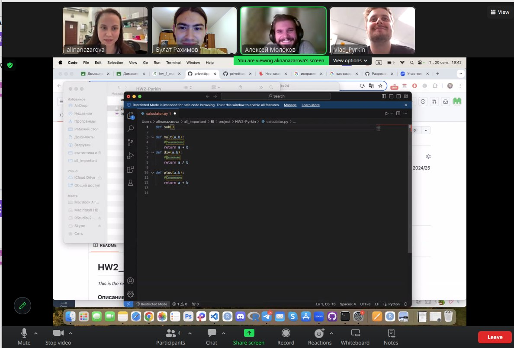

# **Калькулятор**
Наша команда представляет вашему вниманию программу Калькулятор, код которой находится в файле calculator.py.

## **Описание программы**

Калькулятор выполняет 4 операции "+", "-", "/", "*" и содержит функцию main(), которой на вход подается математическое выражение. main() содержит функцию split(), которая разделеяет введенную строку по пробелам и в зависимости от введнеого оператора (проверка условий) перенаправляет выражение на вычисление в соответствующие функции plus, mult, div, или subst. Элементы num1 и num2 преобразуются в тип float. 

## **Системные требования**
Python 3.*

## **Разработчики:**
+ [Пыркин Владислав (Тимлид)](https://github.com/vladisluw95) 
+ [Назарова Алина](https://github.com/privetttppoka)
+ [Рахимов Булат](https://github.com/bulatych)
+ [Молоков Алексей](https://github.com/aymolokov)
  
  
## **Это мы жестко осваивали гит на протяжении 4-х часов:** 

